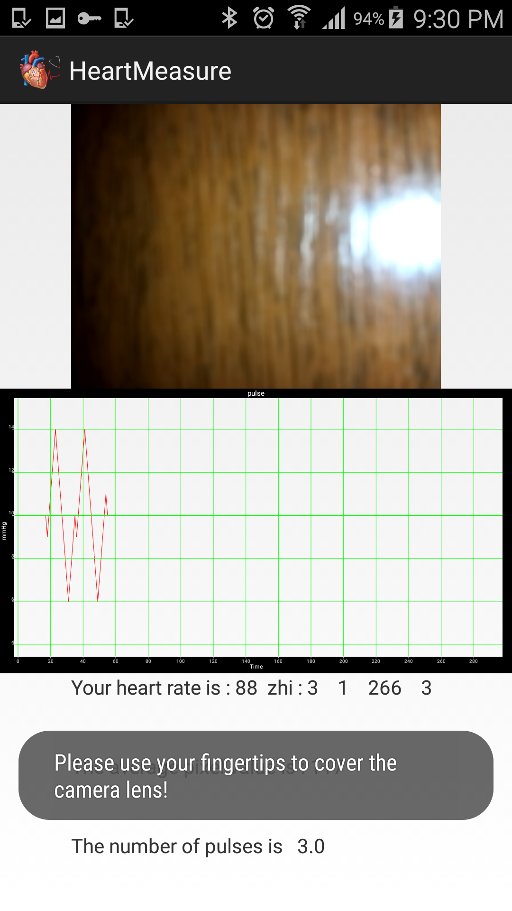

# Heart Rate Measurement

### This is a android app to measure human heart rate from fingertips by camera

The main principle is : 

 When you open this app, the phone's flash will be automatically opened, and user will be finger on the camera head. 
 
 The fingertips of subcutaneous blood vessels due to be pushed, by the finger brightness light source (red depth) will be minor changes. 
 
 This process can be captured with the photosensitive element. 
 Such capillary pulsation can be reflected by periodically changing the screen brightness.

[

When the fringertip on the camera head

[

When not the fringertip on the camera head
